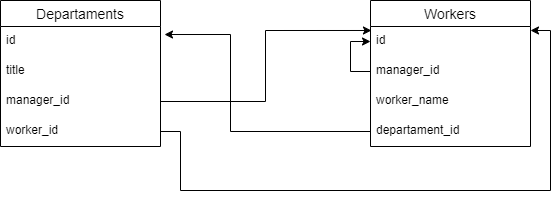

# Домашнее задание к лекции «Проектирование БД. Связи. 3НФ»

## Обязательная часть

[Скрипт музыкального магазина](music_store.sql)

## Дополнительное (необязательное) задание

[Скрипт отдела](departament.sql)